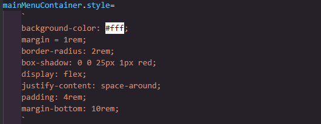
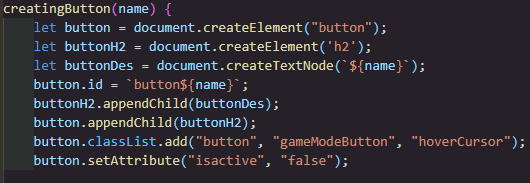
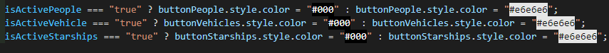
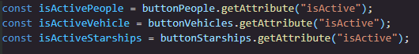
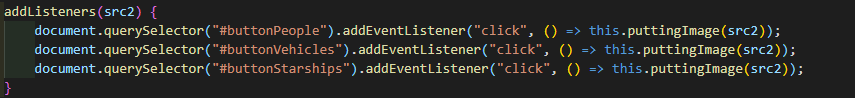

# CODERS CAMP – PROJECT 2
* QUIZ STAR WARS (JAVASCRIPT + REST API + HTML + CSS)

## Development team: 
### Team Leader – mentor:
* Arleta Jędrzejczak
### The project team (in alphabetical order):
1. Stanisław Gardzielewski
2. Sebastian Jajeśnica
3. Mariusz Olszewski
4. Sebastian Raczkowski
5. Bartosz Ratajczak
6. Urszula Wilk

## Technologies used:
1. JavaScript
2. REST API
3. HTML
4. CSS
## LINK TO THE WORKING SITE:
[Quiz Star Wars] (ADRES STRONY WWW „Quiz Star Wars”)
## Game rules:
* The rules of the game consist in choosing the correct answer from among 4 possibilities.The player's task is to determine the name of the character, vehicle or starship. The answer must be adjusted in context to the currently displayed photo.

* The game time is 2 minutes, during which we try to achieve the highest possible score.

* After the game is over, we will get our score along with the opponent's score, which is the computer. 

* Each of your high scores can be saved to the scoreboard !!!

* We invite you to play our Quiz!
## Realized assumptions in the project:
* variables
* comparison operator
* loops
* objects
* attributes
* if statements
* functions
* logical operators
* arrays
* iteration and/or recursion
* console
* return
* "===" vs "=="
* integration with external REST API
* interaction with the DOM
* referencing DOM elements from JavaScript
* changing styles from the JS level
* changing HTML content from the JS level
* animations
* external libraries
* async await and/or Promise
* callback
* HTTP methods
* writing unit tests

### Examples of the implementation of assumptions:
* Example no. 1 - changing styles from the JS level  
	

* Example no. 2 - changing HTML content from the JS level  
	

* Example no. 3 - if statements  
	

* Przykład 4 – variables  
	

* Przykład 5 – interaction with the DOM  
	

### Użyte czcionki:
1. [Font Montserrat](https://fonts.google.com/specimen/Montserrat?query=Montserrat "Font Montserrat")
