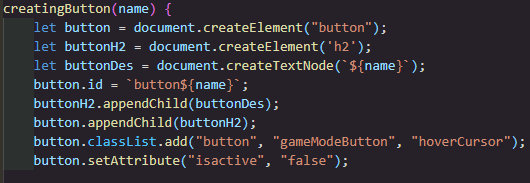
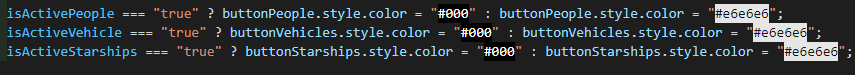
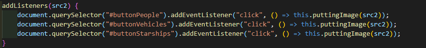

# CODERS CAMP – PROJEKT 2
* QUIZ STAR WARS (JAVASCRIPT + REST API + HTML + CSS)

## Zespół developerski: 
### Team Leader – mentor:
* Arleta Jędrzejczak
### Zespół projektowy (w kolejności alfabetycznej):
1. Stanisław Gardzielewski
2. Sebastian Jajeśnica
3. Mariusz Olszewski
4. Sebastian Raczkowski
5. Bartosz Ratajczak
6. Urszula Wilk

## Użyte technologie:
1. JavaScript
2. REST API
3. HTML
4. CSS
## LINK DO DZIAŁAJĄCEJ STRONY:
[Quiz Star Wars] (ADRES STRONY WWW „Quiz Star Wars”)
## Zasady gry:
* Zasady gry polegają na wyborze poprawnej odpowiedzi spośród 4 możliwości. Zadaniem gracza jest określić nazwę postaci, pojazdu lub statku kosmicznego. Odpowiedź trzeba dopasować w kontekście do aktualnie wyświetlającego się zdjęcia.

Czas rozgrywki to 2 minuty, podczas których staramy się osiągnąć jak najwyższy wynik punktowy. 

Po zakończonej rozgrywce dostaniemy swój wynik wraz z wynikiem przeciwnika, którym jest komputer. 

Każdy swój najlepszy wynik można zapisać do tablicy wyników !!!

* Zapraszamy do gry w nasz Quiz !
## Zrealizowane założenia w projekcie:
* zmienne
* operatory porównania
* pętle
* obiekty, atrybuty
* warunki
* funkcje
* operatory logiczne
* tablice
* iteracja i/lub rekurencja
* console
* return
* "===" vs "=="
* integracja z zewnętrznym REST API
* interakcja z domem
* odwoływanie się do elementów DOM z JavaScript
* zmiana stylów z poziomu JSa
* zmiana zawartości HTML z poziomu JSa
* animacje
* zewnętrzne biblioteki
* async await i/lub Promise
* funkcje callback
* metody HTTP
* pisanie testów jednostkowych

### Przykładowe miejsca realizacji założeń:
* Przykład 1 – opis przykład 1 
	

* Przykład 2 – opis przykład 2 
	

* Przykład 3 – opis przykład 3 
	

* Przykład 4 – opis przykład 4 
	

* Przykład 5 – opis przykład 5 
	

### Użyte czcionki:
1. [Font Montserrat](https://fonts.google.com/specimen/Montserrat?query=Montserrat „Font Montserrat”)
